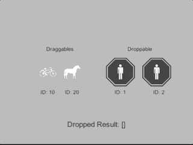

# cafu_dragdrop

## What

* Drag Drop utility for CAFU framework

## Requirement

Sadly, cafu v3 is not supporting now.

For more details, check [package.json](./package.json)

## Install

```shell
yarn add "umm/cafu_dragdrop#^1.0.0"
```

## Usage

See [Example](./Assets/Examples/)



## License

Copyright (c) 2018 Takuma Maruyama

Released under the MIT license, see [LICENSE.txt](LICENSE.txt)

